# Exno: 1 Data Cleaning Process

## Aim

To preprocess the given datasets by inspecting the data, removing missing values, and filtering outliers using z-score and IQR methods.

## Explanation

Data cleaning is the process of preparing data for analysis by removing or modifying incorrect, incomplete, irrelevant, duplicated, or improperly formatted values. In this notebook, the numeric columns are cleaned separately so that text columns such as labels remain unaffected.

## Algorithm

1. Read the dataset.
2. Inspect the structure using `head()`, `info()`, and `describe()`.
3. Remove null values with `dropna()`.
4. Remove outliers using the z-score method on numeric columns.
5. Remove outliers using the IQR method on numeric columns.

## Coding and Output

### Loan Dataset

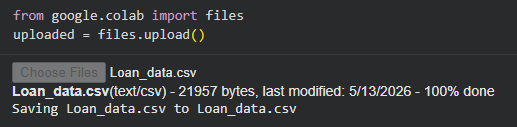
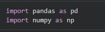
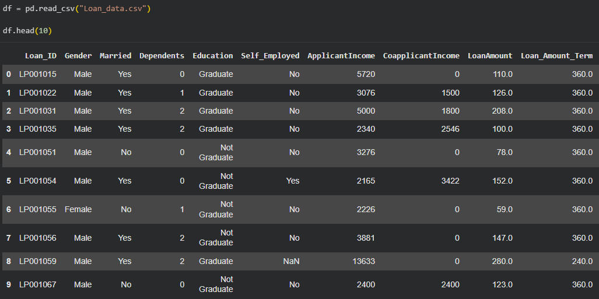
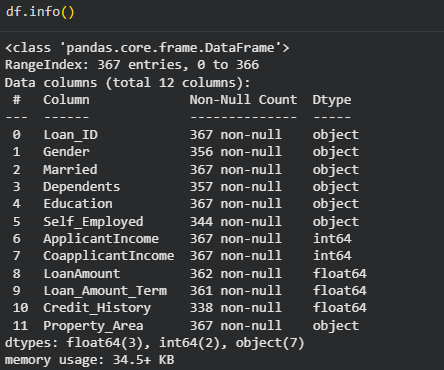

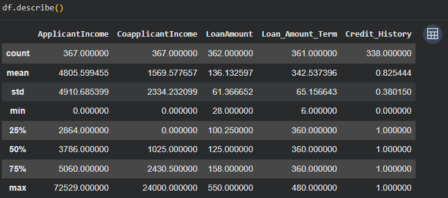
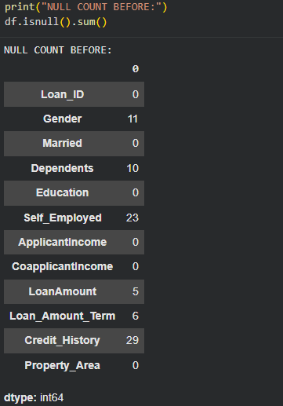
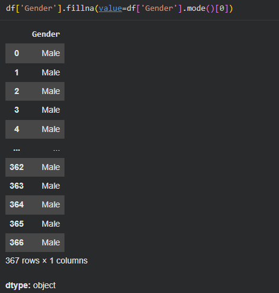
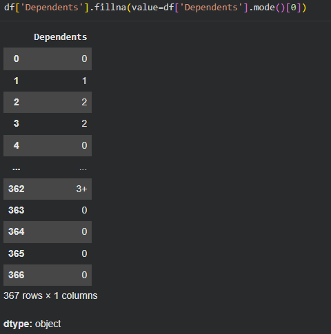
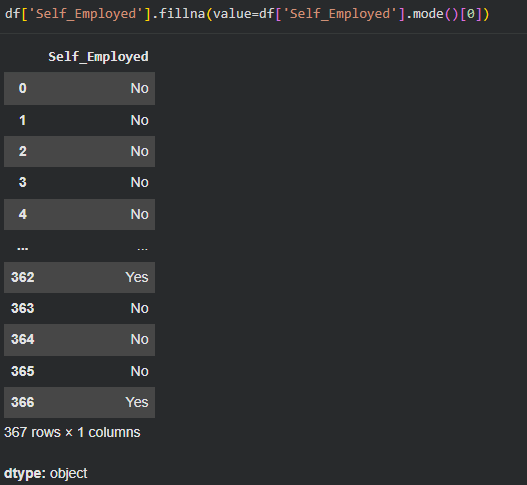
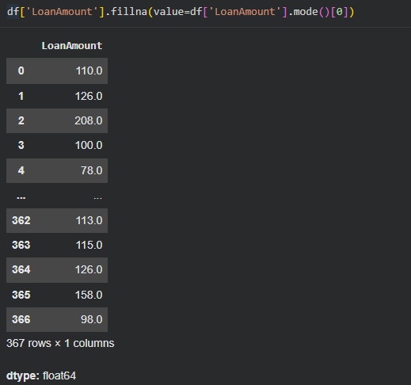
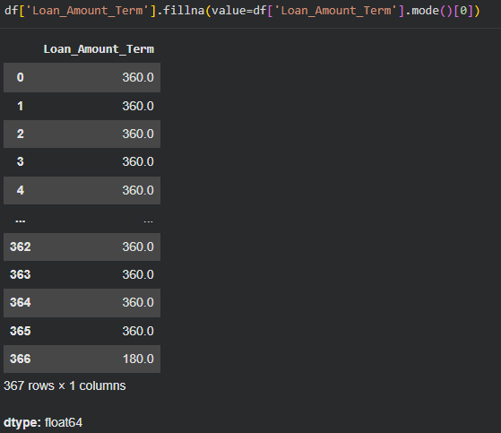
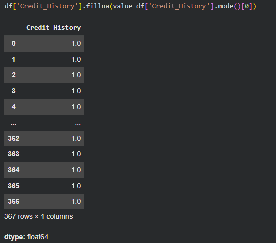

### Iris Dataset

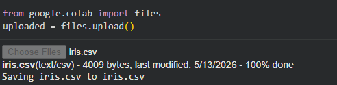
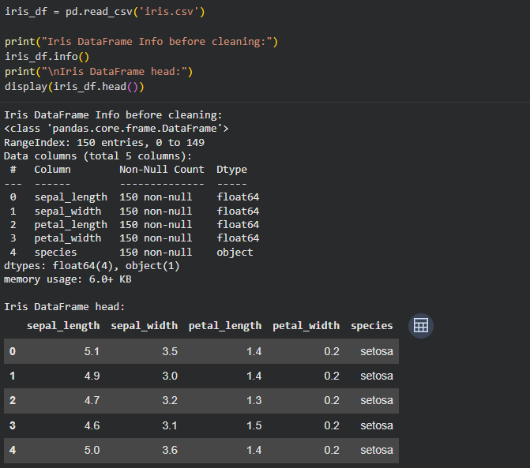
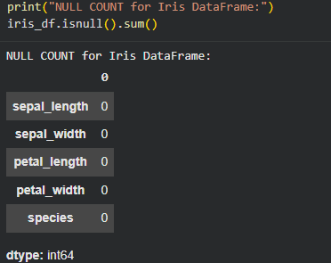
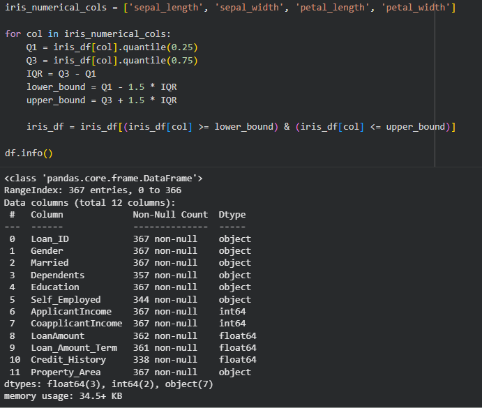
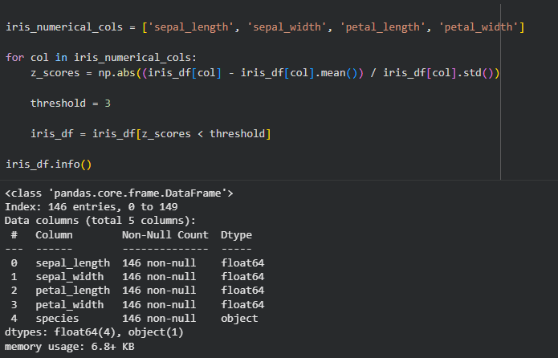

Refer : [Colab Notebook](https://colab.research.google.com/drive/1Uf1W4sON8iDqmspoPAirRkxFJc6bCDAN?usp=sharing)

## Result

The datasets were cleaned successfully by removing missing values and filtering outliers from the numeric features.
